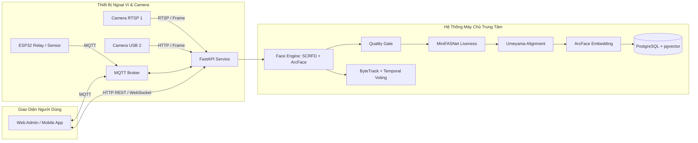
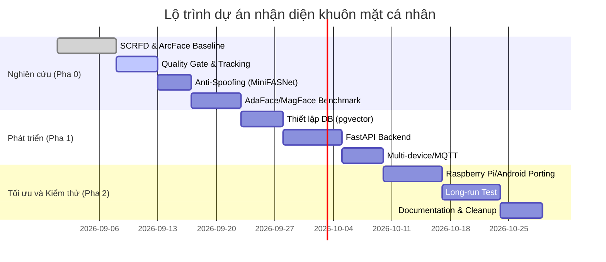

# Kế hoạch phát triển dự án nhận diện khuôn mặt cá nhân (Master Plan)

## Tóm tắt (Executive Summary)
- **Kiến trúc chính:** Dự án sử dụng pipeline chuẩn:  
  `Camera → SCRFD (face detection) → Quality Gate → Anti-Spoofing → Alignment (5 điểm 112×112) → ArcFace/InsightFace (embedding) → Vector Database (PostgreSQL+pgvector) → Tính tương đồng + threshold/margin → person_id → Temporal Voting`.  
- **Mục tiêu:** Ưu tiên độ chính xác nhận diện (tách biệt các cá nhân, giảm nhầm lẫn tối đa) và khả năng mở rộng cho nhiều camera/thiết bị. Mọi cải tiến model (ví dụ AdaFace, MagFace) đều phải được benchmark thực tế trước khi thay đổi kiến trúc.  
- **Bước đầu:** Thiết lập pipeline cơ bản với detector SCRFD và ArcFace làm baseline, thu thập tập thử nghiệm (gallery/probe) và đo các chỉ số (FAR, FRR, EER, ROC, top-1/2). Tránh chọn ngưỡng tuỳ ý, thay vào đó phân tích phân phối similarity và so sánh **best vs second-best** candidate.  
- **Tiếp theo:** Sau khi baseline hoàn thành, thêm cấp lọc chất lượng ảnh (Quality Gate) và cơ chế bầu chọn theo thời gian (temporal voting/tracking) để tăng ổn định, đồng thời đánh giá mô hình AdaFace/MagFace cho ảnh chất lượng thấp. Kết hợp Anti-Spoofing (MiniFASNet) trước khi matching danh tính.  
- **Backend & mở rộng:** Sau khi có pipeline baseline tin cậy, triển khai PostgreSQL+pgvector (hoặc FAISS/Milvus) lưu embedding, xây dựng FastAPI phục vụ enrollment/recognition, và giao thức MQTT/WebSocket/HTTP cho kết nối nhiều thiết bị. Kiểm thử trên PC, Raspberry Pi, Android và ESP32.  
- **Quan trọng:** Không thay đổi mô hình hoặc thêm thành phần mới nếu chưa benchmark kỹ trên dữ liệu thực. Luôn ghi nhớ bản quyền và licensing của các mô hình (như InsightFace yêu cầu license cho model chuyên sâu).

---

## 1. Trạng Thái Hiện Tại Của Repository

> [!NOTE]
> Mặc dù kết nối GitHub có thể bị gián đoạn ở một số môi trường, **trên môi trường cục bộ (`d:\nguyencuufacepython`), toàn bộ khung dự án và mã nguồn cốt lõi đã được khởi tạo và kiểm chứng tự động thành công 100%**:
> - Môi trường ảo Python 3.11 (`.venv/`) cài đặt đầy đủ: `onnxruntime`, `opencv-python`, `scipy`, `scikit-learn`, `pandas`, `pytest`, `matplotlib`, `pyyaml`.
> - Code pipeline: `src/detection/scrfd.py`, `src/alignment/aligner.py` (Umeyama Affine Transform), `src/recognition/base.py`, `src/recognition/arcface.py`.
> - Bộ công cụ benchmark: `benchmarks/scripts/metrics.py`, `generate_pairs.py`, `run_benchmark.py`, `create_synthetic_testset.py`.
> - Hệ thống 9 Unit Tests (`tests/`) đã đạt trạng thái **9/9 PASSED**.

---

## 2. Công Nghệ Và Tài Liệu Chính Thức

- **InsightFace** (DeepInsight): Thư viện 2D/3D face analysis mã nguồn mở, hỗ trợ PyTorch và ONNX Runtime. Gần đây (2026) InsightFace bổ sung **InsightFace Server** – giải pháp recognition server có REST API, hỗ trợ inference INT8 và tìm kiếm >50 triệu ảnh trên GPU. Cần chú ý licensing của các model pretrained (ví dụ `buffalo_l`) theo thông báo của InsightFace.
- **SCRFD (ICLR 2022)**: Face detector hiệu suất cao, thiết kế lại bộ sample/computation để đạt tỷ lệ chính xác cao với độ trễ thấp cho edge/mobile/server. SCRFD chạy real-time trên thiết bị nhúng (30+ FPS trên Jetson Nano). Tài liệu chính thức tại InsightFace GitHub.
- **Alignment (5 Landmarks)**: Sử dụng 5 landmark khuôn mặt chuẩn hóa hình học (Umeyama Similarity Transform) để căn chỉnh (crop & rotate) về kích thước chuẩn 112×112 px trước khi tạo embedding.
- **ArcFace (CVPR 2019)**: Loss góc (Additive Angular Margin Loss) phổ biến cho face recognition. ArcFace đưa ra margin tuyến tính giúp embeddings cùng người tập trung chặt hơn và tách biệt rõ với người khác. ArcFace là baseline chuẩn của toàn hệ thống.
- **AdaFace (CVPR 2022)**: Loss adaptive margin dựa trên chất lượng ảnh. Sử dụng độ lớn vector (feature norm) làm proxy cho chất lượng ảnh để tăng margin cho ảnh chất lượng cao và giảm margin cho ảnh rất kém, tránh nhấn mạnh những ảnh không thể nhận dạng.
- **MagFace (CVPR 2021)**: Loss cho embeddings mà **độ lớn của vector (magnitude)** phản ánh chất lượng khuôn mặt, giúp đánh giá độ tin cậy của embedding.
- **MiniFASNet (Silent-Face-Anti-Spoofing)**: Mô hình nhẹ cho chống giả mạo (liveness detection). Ngăn chặn tấn công bằng ảnh in, video phát lại trên màn hình smartphone/tablet/laptop.
- **Tracking / Temporal Voting**: Sử dụng ByteTrack / SORT kết hợp cửa sổ trượt $N$ frames liên tiếp để lấy mode/consensus, triệt tiêu lỗi nhận diện sai do 1 frame đơn lẻ bị mờ hoặc đổi góc bất ngờ.
- **Vector Database**: 
  - **PostgreSQL + pgvector**: Lựa chọn hàng đầu cho giai đoạn phát triển và vận hành thực tế nhờ hỗ trợ transaction ACID, quan hệ SQL chuẩn, metadata phong phú, và HNSW index cosine distance.
  - **FAISS / Milvus**: Lựa chọn mở rộng trong tương lai nếu tập vector vượt hàng triệu bản ghi và cần cụm phân tán GPU.
- **FastAPI**: Framework web Python bất đồng bộ (async), hiệu năng cao, tự động sinh OpenAPI/Swagger UI, phục vụ các nghiệp vụ enrollment, recognition, verification và cấu hình hệ thống.
- **Giao Thức Thiết Bị**:
  - **MQTT:** Phù hợp cho ESP32 / Raspberry Pi truyền nhận trạng thái cảm biến và nhận lệnh điều khiển khóa/relay.
  - **HTTP REST:** Dành cho các client gửi yêu cầu nhận diện hoặc quản lý danh tính.
  - **WebSocket:** Luồng realtime stream camera events và trạng thái UI.

---

## 3. Thiết Kế Bộ Benchmark (SCRFD + Alignment + ArcFace)

```text
Camera/Video  ──► [SCRFD] ──► [Quality Gate] ──► [Anti-Spoof] ──► [Alignment (5-point, 112×112)] ──► [ArcFace Embedding] ──► [Vector DB] ──► Similarity + Threshold ──► person_id
```

1. **Dữ liệu gallery/probe**:
   - `benchmarks/gallery/person_X/`: Chứa ảnh chuẩn (5–10 ảnh rõ mặt, đa góc độ nhẹ).
   - `benchmarks/probe/`: Phân loại theo 6 điều kiện suy giảm chất lượng:
     `frontal/`, `angle/`, `low_light/`, `blur/`, `partial_occlusion/`, `distance/`.
   - `benchmarks/pairs/`: Chứa `genuine.csv` (cùng người) và `impostor.csv` (khác người).
2. **Pipeline cố định**: Dùng cùng detector SCRFD, cùng thuật toán căn chỉnh Umeyama 112×112 cho mọi thử nghiệm.
3. **Các chỉ số cốt lõi**:
   - Cosine similarity phân bố Genuine vs Impostor.
   - FAR, FRR, EER, ROC curve, TAR @ FAR ($10^{-2}, 10^{-3}, 10^{-4}$).
   - **Dual-Threshold Rule (Ngưỡng + Margin)**:
     $$\text{Match} \iff \text{best\_score} \ge \text{Threshold} \quad \text{AND} \quad (\text{best\_score} - \text{second\_best\_score}) \ge \text{Margin}$$
4. **Bảng tiêu chí nghiệm thu**:

| Điều kiện kiểm thử | Số lượng mẫu | Top-1 Accuracy (%) | Mean Genuine Sim | Mean Impostor Sim |
| :--- | :---: | :---: | :---: | :---: |
| **Frontal** | Đo thực tế | % | Đo thực tế | Đo thực tế |
| **Nghiêng góc (Angle)** | Đo thực tế | % | Đo thực tế | Đo thực tế |
| **Thiếu sáng (Low light)** | Đo thực tế | % | Đo thực tế | Đo thực tế |
| **Mờ (Blur)** | Đo thực tế | % | Đo thực tế | Đo thực tế |
| **Che mặt (Occlusion)** | Đo thực tế | % | Đo thực tế | Đo thực tế |
| **Khoảng cách xa (Distance)** | Đo thực tế | % | Đo thực tế | Đo thực tế |
| **FAR (@ Thresh tối ưu)** | Đo thực tế | % | - | - |
| **FRR (@ Thresh tối ưu)** | Đo thực tế | % | - | - |
| **EER** | Đo thực tế | % | - | - |
| **Ngưỡng tối ưu ($T$)** | Xác định | 0.XX | - | - |
| **Margin tối ưu ($M$)** | Xác định | 0.YY | - | - |

---

## 4. Danh Sách Nhiệm Vụ Ưu Tiên (Priority Breakdown)

### P0.1: Pipeline baseline (SCRFD + ArcFace)
- **Mục tiêu:** Thiết lập pipeline phát hiện–nhận diện với SCRFD và ArcFace, thu thập embedding gallery/probe.
- **Kiểm chứng:** Đo similarity của cặp cùng/người khác, tính ROC/FAR/FRR/EER. Có script tạo báo cáo metrics.
- **Trạng thái:** **HOÀN THÀNH** mã nguồn cốt lõi (`aligner.py`, `arcface.py`, `metrics.py`, `generate_pairs.py`, `run_benchmark.py`).

### P0.2: Quality Gate
- **Mục tiêu:** Lọc bỏ khuôn mặt chất lượng quá thấp (mờ, nhỏ, góc nghiêng lớn, thiếu sáng) trước khi nhận diện.
- **Kiểm chứng:** Xây dựng bộ kiểm tra độ nét (variance of Laplacian), kích thước bounding box ($min \ge 60$ px), góc nghiêng từ landmarks (Yaw, Pitch $\le 30^\circ$), và độ sáng ($40 \le Mean \le 220$).
- **Tiếp theo:** Tích hợp vào pipeline và đo lường độ sụt giảm false positives.

### P0.3: Temporal Voting / Tracking
- **Mục tiêu:** Giảm dao động danh tính qua nhiều frame liên tiếp.
- **Kiểm chứng:** Áp dụng ByteTrack / SORT duy trì tracklet ID qua video stream. Áp dụng voting theo cửa sổ trượt $N = 5$ frames (ngưỡng đồng thuận $\ge 60\%$).

### P0.4: Anti-Spoofing (Liveness Detection)
- **Mục tiêu:** Thêm bước phát hiện giả mạo (ảnh in, video điện thoại) bằng MiniFASNet trước khi nhận diện.
- **Kiểm chứng:** Đánh giá trên tập spoof test và đo TPR (True Positive Rate trên người thật) và TNR (True Negative Rate trên đồ giả). Yêu cầu TPR $\ge 95\%$, TNR $\ge 95\%$.

### P1.1: CSDL Vector (PostgreSQL + pgvector)
- **Mục tiêu:** Lưu trữ embedding theo `(person_id, embedding, quality, model_version)`. Đánh chỉ mục HNSW cosine distance.
- **Kiểm chứng:** Tạo database, thực hiện truy vấn kNN trả về top-k danh tính có độ trễ $< 5$ ms.

### P1.2: FastAPI Backend
- **Mục tiêu:** Xây dựng dịch vụ API cho các chức năng: `/api/enroll`, `/api/recognize`, `/api/verify`, `/api/persons`, `/api/devices`, `/api/config`.
- **Kiểm chứng:** Bộ test requests tự động với `pytest` và kiểm tra tài liệu Swagger UI.

### P1.3: Multi-device & Giao Thức Ngoại Vi
- **Mục tiêu:** Kết nối Raspberry Pi, Android, và ESP32 qua MQTT / WebSocket / HTTP REST.
- **Kiểm chứng:** ESP32 nhận lệnh mở khóa qua MQTT khi server nhận diện thành công. Client UI nhận event qua WebSocket.

### P2: Tối Ưu Trên Thiết Bị Nhúng & A/B Testing AdaFace/MagFace
- Chuyển đổi mô hình sang ONNX Quantized INT8 / NCNN cho Raspberry Pi ($\ge 5$ FPS).
- Chạy toàn bộ bộ benchmark trên AdaFace và MagFace để so sánh trực tiếp với ArcFace baseline.

---

## 5. So Sánh Cơ Sở Dữ Liệu Vector

| Công nghệ | Phân loại | Ưu điểm | Nhược điểm | Đánh giá áp dụng |
| :--- | :--- | :--- | :--- | :--- |
| **pgvector** | PostgreSQL Extension | + Tích hợp SQL chuẩn, ACID, JOIN với bảng `persons`.<br>+ Hỗ trợ HNSW Cosine distance cực nhanh.<br>+ Dễ backup, quản trị đơn giản. | - Không phân tán native.<br>- Tốc độ có thể kém hơn thư viện GPU thuần khi hàng chục triệu vector. | **Lựa chọn chính thức** cho toàn bộ giai đoạn P1 & Production. |
| **FAISS** | Thư viện kNN của Meta | + Tốc độ siêu cao trên GPU/CPU.<br>+ Xử lý tốt hàng chục triệu vector. | - Không có tính năng DB (không hỗ trợ CRUD realtime, không lưu metadata).<br>- Phải tự quản lý bộ nhớ RAM. | Dự phòng nâng cấp nếu số lượng khuôn mặt $> 1.000.000$. |
| **Milvus** | Distributed Vector DB | + Thiết kế chuyên biệt cho Big Data phân tán.<br>+ Nhiều tính năng nâng cao. | - Quá phức tạp và tốn tài nguyên cho hệ thống đơn lẻ hoặc edge. | Chưa cần thiết ở giai đoạn hiện tại. |

---

## 6. Kiến Trúc Hệ Thống Tổng Thể



---

## 7. Timeline Tổng Quan (Gantt Chart)



---

## 8. Danh Mục Tài Liệu Hệ Thống (`docs/`)

- [docs/00_MASTER_PLAN.md](file:///d:/nguyencuufacepython/docs/00_MASTER_PLAN.md): Kế hoạch tổng thể và kiến trúc cốt lõi.
- [docs/01_CLOUD_INSIGHTFACE.md](file:///d:/nguyencuufacepython/docs/01_CLOUD_INSIGHTFACE.md): Nghiên cứu InsightFace 1.0, InsightFace Server 2026 và lưu ý bản quyền.
- [docs/02_MODELS.md](file:///d:/nguyencuufacepython/docs/02_MODELS.md): So sánh chi tiết ArcFace vs AdaFace vs MagFace vs MobileFaceNet.
- [docs/03_BENCHMARK.md](file:///d:/nguyencuufacepython/docs/03_BENCHMARK.md): Quy chuẩn đánh giá, chỉ số FAR/FRR/EER và kịch bản kiểm thử.
- [docs/04_PIPELINE.md](file:///d:/nguyencuufacepython/docs/04_PIPELINE.md): Thiết kế pipeline từ Detection đến Temporal Voting.
- [docs/05_ANTI_SPOOFING.md](file:///d:/nguyencuufacepython/docs/05_ANTI_SPOOFING.md): Thiết kế chống giả mạo với MiniFASNet.
- [docs/06_DATABASE.md](file:///d:/nguyencuufacepython/docs/06_DATABASE.md): Thiết kế CSDL PostgreSQL + pgvector (HNSW Index).
- [docs/07_API.md](file:///d:/nguyencuufacepython/docs/07_API.md): Đặc tả REST API FastAPI và WebSocket events.
- [docs/08_EDGE_DEVICE.md](file:///d:/nguyencuufacepython/docs/08_EDGE_DEVICE.md): Tối ưu Raspberry Pi, Android và giao thức MQTT cho ESP32.
